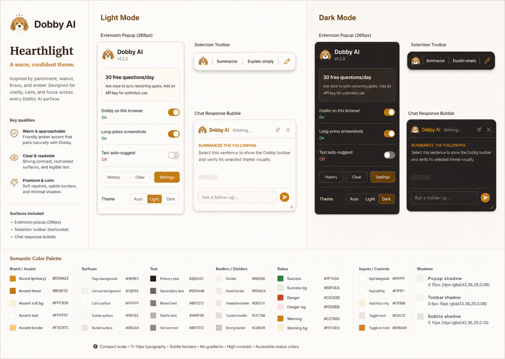
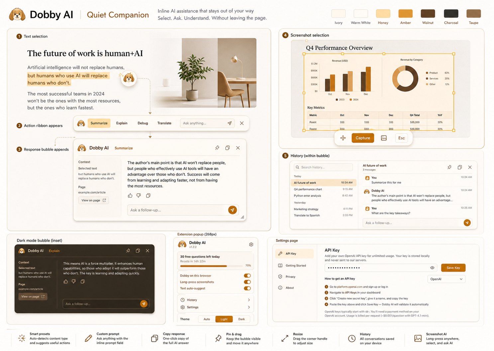
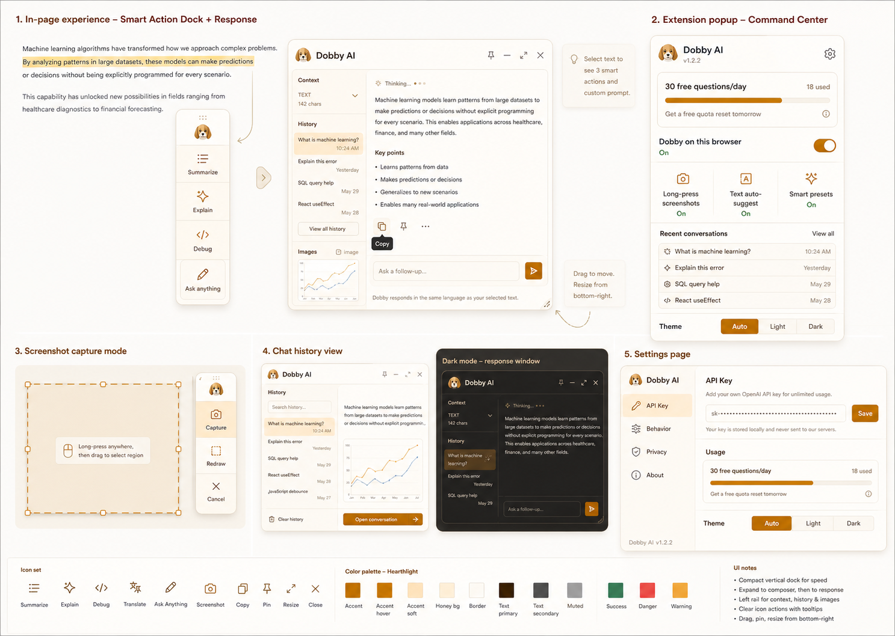
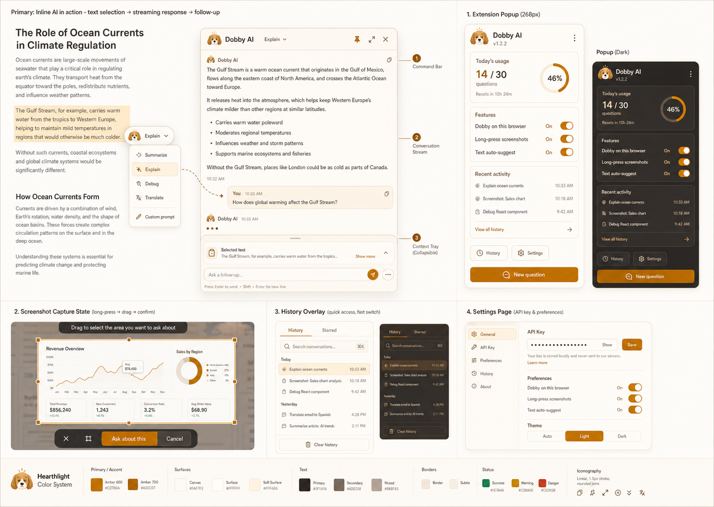

# Dobby AI Hearthlight Redesign Proposal

Status: Saved for future selection
Created: June 6, 2026
Implementation status: Not started

## Confirmed Direction

- Use the **Hearthlight** complete color theme.
- Keep the existing Dobby logo unchanged.
- Redesign the complete extension experience, excluding marketing pages.
- Preserve all current product capabilities.
- Keep the product compact, work-focused, approachable, and realistic to implement.

## Product Surfaces In Scope

- Text-selection trigger and smart action toolbar
- Custom prompt mode
- Streaming response bubble and follow-up conversations
- Copy, pin, drag, resize, and close actions
- Conversation history
- Screenshot selection and capture controls
- Right-click image analysis
- Text autosuggest states
- Extension popup
- Settings and API-key page
- Light, dark, and auto appearance modes

## Hearthlight Color System

Hearthlight uses warm ivory and warm-white surfaces, charcoal-brown text, taupe
secondary text, brass and amber accents, and pale honey selected states. Dark
mode uses warm graphite and walnut-charcoal surfaces with a golden amber accent.

The palette should retain accessible, clearly distinct success, warning, and
danger states.

## Option 1: Quiet Companion

An inline-first workflow with strong spatial continuity:

- A small Dobby trigger unfolds into a slim horizontal action ribbon.
- The same anchored surface expands into the response bubble.
- History opens within the bubble.
- Popup remains a compact status and control center.
- Settings uses a quiet single-column structure.

Strengths:

- Closest to the current interaction model
- Calm and approachable
- Lowest user-learning and implementation risk

Tradeoff:

- Less optimized for power-user speed and long conversations

## Option 2: Smart Action Dock

A discoverability-first workflow centered on a compact vertical action dock:

- Context-aware actions remain visible beside the selection.
- The dock expands into a prompt composer and response workspace.
- A narrow rail provides context, history, and image access.
- Screenshot capture reuses the same vertical control language.
- Popup becomes a denser command center.

Strengths:

- Fast and highly discoverable
- Strongest option for power users
- Unifies text and screenshot workflows

Tradeoff:

- Most visually assertive option and the largest departure from the current UI

## Option 3: Focused Canvas

A balanced workflow optimized for ongoing conversations and visual analysis:

- Initial interaction remains a compact recommended-action pill.
- The response becomes a focused three-zone canvas.
- A collapsible context tray holds selected text or captured images.
- History appears as a quick-switch overlay.
- Popup provides daily status, feature health, and recent activity.

Strengths:

- Best balance of compact entry and capable response experience
- Strong hierarchy for conversations and image analysis
- Clearer popup and settings organization

Tradeoff:

- Requires more structural UI work than Quiet Companion

## Recommendation

**Focused Canvas** is the recommended direction. It gives Dobby more room to
support conversations and visual analysis without making the initial browser
interaction heavy.

Quiet Companion is the safer choice when minimizing redesign risk is the
priority. Smart Action Dock is the best choice when discoverability and
power-user speed are the priority.

## Future Decision

Before implementation, choose one option or define a hybrid. A useful hybrid
would combine Quiet Companion's anchored action ribbon with Focused Canvas's
response hierarchy, context tray, and popup.
